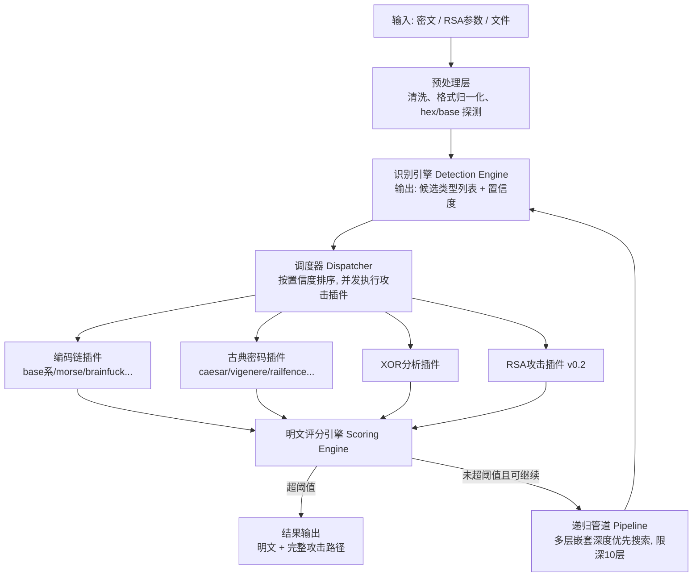

# CipherScope 架构设计文档

> CTF 密码学自动化解题工具 —— 输入密文，自动识别类型、调度攻击、判定明文、输出 flag。
>
> 版本：v0.1 设计稿 | 技术栈：Python 3.11+ | 作者：（待填）

---

## 1. 项目定位

### 1.1 一句话定义

**CipherScope 是一个面向 CTF 密码学赛题的自动化攻击框架**：给定一段密文，自动完成「类型识别 → 攻击调度 → 明文评分 → 结果输出」的完整链路，无需人工逐一手动尝试。

### 1.2 与现有工具的差异化

| 工具 | 能力 | 缺口 |
|---|---|---|
| CyberChef | 手动编解码/加解密操作集合 | 无自动化，依赖人工逐个尝试 |
| Ciphey | 自动识别+解密 | 古典密码覆盖弱，无 RSA 攻击，中文 CTF 题型适配差 |
| RsaCtfTool | RSA 攻击脚本集 | 仅限 RSA，无识别与调度链路 |
| hashcat / john | 哈希爆破 | 不解决"这是什么"的问题 |

**CipherScope 的核心差异**：
1. **全链路自动化**：识别、攻击、评分、回溯一体化，而非单点工具；
2. **明文评分引擎**：基于多信号融合的自动成功判定（详见 §4.4），是架构核心；
3. **插件化攻击框架**：每种密码攻击是可插拔插件，支持并发调度与置信度排序；
4. **真题驱动**：以历届 CTF 赛题语料库为测试基准，通过率可量化、可复现。

---

## 2. 系统架构



**分层说明**：

| 层 | 职责 | 关键设计 |
|---|---|---|
| 接入层 | CLI / Web API / 文件输入 | CLI 优先，Web 为 v0.3 |
| 识别层 | 密文类型判定 | 多维特征 + 置信度排序 |
| 调度层 | 插件编排 | 置信度排序、并发、短路返回 |
| 攻击层 | 具体密码攻击实现 | 插件化，统一接口 |
| 判定层 | 明文质量评分 | 多信号加权融合 |
| 数据层 | n-gram 频率表、字典、真题语料 | 静态资源随包分发 |

---

## 3. 统一插件接口

所有攻击模块实现同一协议，这是整个框架的扩展性基础：

```python
# cipherscope/core/plugin.py
from typing import Iterator, Protocol
from dataclasses import dataclass

@dataclass
class Candidate:
    """一次攻击尝试的产出"""
    plaintext: bytes
    score: float            # 评分引擎打分, 0~100
    method: str             # 攻击方法描述, 如 "vigenere(key='lemon')"
    chain: list[str]        # 到达该结果的完整攻击路径

class AttackPlugin(Protocol):
    name: str
    category: str           # codec / classical / xor / hash / rsa

    def match(self, ct: bytes) -> float:
        """对输入密文的适用性置信度, 0~1。调度器据此排序。"""
        ...

    def attack(self, ct: bytes) -> Iterator[Candidate]:
        """执行攻击, 惰性产出候选明文(可能多个密钥候选)。"""
        ...
```

**设计要点**：
- `match()` 与 `attack()` 分离：调度器先跑所有插件的 `match()`（轻量），按置信度降序调度 `attack()`（重量），避免无效计算；
- `attack()` 返回迭代器：支持惰性产出与并发消费，评分引擎判定超阈值后立即短路，剩余候选不再计算；
- 插件通过 `entry_points` 自动发现，第三方可用 `pip install cipherscope-plugin-xxx` 扩展。

---

## 4. 核心模块详细设计

### 4.1 识别引擎（Detection Engine）

**输入**：原始密文字节流。**输出**：`[(cipher_type, confidence), ...]` 按置信度降序。

特征提取维度：

| 特征 | 方法 | 判别能力 |
|---|---|---|
| 字符集 | 统计字符分布，匹配已知字母表（hex/base64/base85/摩斯/Brainfuck） | 识别编码类型 |
| 信息熵 | Shannon entropy | 区分编码（熵规律）与随机化加密（熵接近上限） |
| 长度特征 | base64 长度 %4==0；hex 偶数长度；MD5/SHA 系固定 hex 长度 32/40/64 | 识别编码与哈希 |
| 正则模式 | 摩斯 `^[.\- /]+$`；培根二元模式；`=` padding | 强特征快速命中 |
| 重合指数 IC | 英文单表 ≈0.066，多表/随机 ≈0.038 | **区分单表替换（凯撒/仿射）与多表（维吉尼亚）** |
| Kasiski 检验 | 重复片段间距的公约数 | 推断维吉尼亚密钥长度 |

### 4.2 编码链管道（Codec Pipeline）

CTF 高频题型是"base 套娃"（多层嵌套编码）。管道做**深度优先搜索**：

```
输入 → 尝试所有 match>0 的编码解码 → 每层过评分引擎
     → 命中 flag 格式: 返回完整解码链
     → 未命中且深度<10: 对输出递归下一层
     → 循环检测: 对已见字节流做哈希, 防死循环
```

覆盖编码：base16/32/64/85/91、URL、HTML 实体、hex、二进制/八进制 ASCII、摩斯、Brainfuck、Ook!、JSFuck、UUencode、Quoted-printable。

### 4.3 古典密码攻击库

| 密码 | 攻击方法 | 密钥空间 |
|---|---|---|
| Caesar / ROT 系 | 26 密钥穷举 + 评分 | 26 |
| Atbash | 固定变换 | 1 |
| 仿射 Affine | (a,b) 穷举，a 须与 26 互素 | 12×26 = 312 |
| 维吉尼亚 Vigenère | IC + Kasiski 定钥长 → 按列频率分析逐位定钥 | 自动推断 |
| 栅栏 Rail Fence | 栏数穷举（2 ~ n/2），含 W 型变种 | O(n) |
| 培根 Baconian | 二元模式 → 24/26 字母表两变体 | 2 |
| Playfair | 模拟退火 + quadgram 评分优化密钥方阵 | 启发式 |
| Hill | 已知明文求逆矩阵 (mod 26) | 需已知明文 |
| 键盘位移 | QWERTY 邻键映射穷举（左移/右移） | 2 |
| 猪圈/跳舞小人等图形密码 | 查表映射（提供字典，半自动） | — |

### 4.4 明文评分引擎（Scoring Engine）—— 架构核心

自动化链路的成败取决于"机器如何判断解密成功"。采用**多信号加权融合**：

```
score = w1·flag正则命中(0或60) + w2·quadgram适应度(0~25)
      + w3·可打印字符比例(0~10) + w4·常用词命中率(0~15)
      + w5·字符分布卡方值(0~10)      满分 100, 成功阈值 70
```

1. **flag 格式正则**（权重最高）：`flag{` / `CTF{` / `NSSCTF{` / `XYCTF{` 等目标平台前缀 + 用户自定义前缀，命中即基本判定成功；
2. **Quadgram 适应度**：基于英文四元组频率表（约 25 万组，来自语料统计，随包分发 `data/quadgrams.json`），对候选明文做 log 概率求和——密码学攻击的经典方法，对维吉尼亚/Playfair 的密钥搜索尤为关键；
3. **可打印字符比例**：快速过滤二进制噪声；
4. **常用词字典**：the/and/of/to 等 top-100 英文词 + flag/key/crypto 等 CTF 高频词；
5. **卡方检验**：候选明文与英文标准频率分布的偏离度；
6. **中文兜底**（已确认需求）：候选明文 UTF-8 解码后中文字符占比超阈值（初定 30%）且非乱码区间，叠加 flag 格式命中即判定成功——覆盖国内赛事明文含中文的场景（英文 quadgram 方案的已知盲点），实现成本约半天。完整中文 n-gram 评分模型列为 v0.2+ 候选迭代项。

> **面试谈资**：评分引擎本质是一个小型分类器。v0.2 可引入特征权重调参（用真题语料库做网格搜索），讲"如何用数据驱动方法把通过率从 X% 优化到 Y%"。

### 4.5 XOR 分析插件

- **单字节 XOR**：256 穷举 + 评分引擎；
- **多字节（重复密钥）**：归一化汉明距离推断密钥长度 → 按列单字节频率分析（Cryptopals Set 1 标准方法）；
- **已知明文攻击**：利用 `flag{` 等已知前缀异或反推密钥片段；
- **两文互异或**：检测密钥复用（crib dragging 半自动）。

### 4.6 RSA 攻击模块（v0.2）

输入：`n, e, c` 参数 或 PEM/DER 公钥文件。

| 攻击 | 触发条件 | 依赖 |
|---|---|---|
| 小模数分解 | n 位数 < 阈值，查 factordb API + sympy/gmpy2 本地分解 | sympy, gmpy2, requests |
| 低加密指数 | e=3 且 m^e < n，直接整数开方 | gmpy2 |
| 共模攻击 | 同 n 不同 e 两份密文，扩展欧几里得 | 自实现 |
| 维纳攻击 | 私钥 d < n^0.25/3，连分数展开 | 自实现连分数 |
| 多 n 公约数 | 多组 n 两两求 gcd | math.gcd |
| Håstad 广播 | 同明文多接收者低 e | 中国剩余定理 |
| dp/dq 泄露 | 已知 dp 推 p | 自实现 |

### 4.7 哈希识别插件

正则 + 长度匹配识别 MD5/SHA1/SHA256/SHA512/MySQL 老哈希/NTLM 等，接字典爆破（内置 top-10k 弱口令字典 + 用户自定义字典），预留 hashcat 外部调用接口。

---

## 5. 项目结构

```
CipherScope/
├── pyproject.toml              # 打包配置, entry_points 插件注册
├── README.md                   # 含真题通过率徽章 (核心展示面)
├── cipherscope/
│   ├── __init__.py
│   ├── cli.py                  # typer CLI 入口
│   ├── core/
│   │   ├── plugin.py           # 插件协议与注册表
│   │   ├── detector.py         # 识别引擎
│   │   ├── scorer.py           # 评分引擎
│   │   ├── dispatcher.py       # 并发调度器
│   │   └── pipeline.py         # 嵌套解码 DFS
│   ├── plugins/
│   │   ├── codecs/             # base系/morse/brainfuck/... (v0.1)
│   │   ├── classical/          # caesar/vigenere/... (v0.1)
│   │   ├── xor/                # (v0.1)
│   │   ├── hashid/             # (v0.2)
│   │   └── rsa/                # (v0.2)
│   ├── data/
│   │   ├── quadgrams.json      # 四元组频率表
│   │   └── wordlist.txt        # 常用词/弱口令字典
│   └── web/                    # FastAPI + 前端 (v0.3)
├── tests/
│   ├── unit/                   # 插件级单元测试
│   └── ctf_corpus/             # 真题语料库 + 通过率评测脚本
│       ├── corpus.yaml         # 题目/密文/期望flag/出处平台
│       └── eval.py
└── docs/
    ├── modules/                # 逐模块讲解文档 (见 §11 知识转移计划)
    │   ├── 01-评分引擎.md
    │   ├── 02-识别引擎.md
    │   ├── 03-古典密码攻击.md
    │   └── 04-XOR分析.md
    └── 复盘博客草稿.md          # 简历证据链素材
```

**CLI 设计**：

```bash
cipherscope auto "VGhlIHF1aWNr..."            # 全自动: 识别+攻击+评分
cipherscope auto --flag-format "NSSCTF{" ...  # 自定义flag前缀
cipherscope decode --chain base64,hex "..."   # 手动指定解码链
cipherscope attack vigenere "..."             # 指定攻击
cipherscope rsa -n 123... -e 65537 -c 456...  # RSA模式 (v0.2)
cipherscope eval                              # 跑真题语料库通过率
```

---

## 6. 依赖与工程规范

- **核心依赖**：`typer`（CLI）、`rich`（输出美化）、`pycryptodome`、`sympy`、`gmpy2`（v0.2）
- **开发依赖**：`pytest`、`ruff`（lint）、`mypy`（类型检查）
- **工程规范**：语义化版本； conventional commits；每个 PR 带测试；README 维护通过率徽章
- **许可证**：MIT（个人项目，最大化传播与简历可用性）
- **发布形式**（已确认）：GitHub 公开仓库 + PyPI 发布，v0.1 完成即 `pip install cipherscope` 可用，插件 entry_points 生态叙事完整

---

## 7. 测试策略：真题语料库（简历核心素材）

`tests/ctf_corpus/corpus.yaml` 收集公开平台练习题，**语料来源已确认为四个平台**（均含公开题解生态，便于校验答案）：

| 平台 | 定位 | flag 前缀 |
|---|---|---|
| BUUCTF | 国内最大练习平台，题目按难度分级 | `flag{` |
| 攻防世界 | writeup 生态完善，便于交叉校验 | `flag{` / `cyberpeace{` |
| NSSCTF | 新锐平台，题目较新 | `NSSCTF{` |
| CTFHub / picoCTF | 技能树体系化；国际赛题验证英文评分引擎 | `CTFHub{` / `picoCTF{` |

```yaml
- id: buu-crypto-001
  source: BUUCTF
  category: classical/vigenere
  ciphertext: "..."
  expected_flag: "flag{...}"
```

`cipherscope eval` 输出**按平台 × 密码类型**的二维通过率报表。**目标：v0.1 收录 ≥30 题（四平台均衡取样），综合通过率 ≥70%**——这个数字直接写进简历："对 30+ 历届 CTF 真题自动化求解通过率 70%+"。

---

## 8. 里程碑路线

| 版本 | 周期（业余） | 内容 | 验收标准 |
|---|---|---|---|
| v0.1 | 第 1~2 周 | core 四件套 + codecs + classical + xor + CLI | 真题集 ≥30 题（四平台均衡），通过率 ≥70%，单测覆盖核心模块，同步交付讲解文档 4 篇（见 §11） |
| v0.2 | 第 3~4 周 | RSA 攻击模块 + 哈希识别 + 评分权重调参 | RSA 真题 ≥10 题通过，通过率报告对比 v0.1，讲解文档 +2 篇 |
| v0.3 | 第 5~6 周 | FastAPI Web UI + 性能优化（并发调度压测）+ 复盘博客 | Web 端可用，发布技术博客 1 篇，PyPI 发布 v1.0 |

---

## 9. 简历呈现方式（预演）

> **CipherScope — CTF 密码学自动化攻击框架**（个人项目，Python）
> - 设计并实现"识别 → 调度 → 攻击 → 评分"全自动化链路，插件化架构支持 20+ 种密码攻击，第三方可通过 entry_points 扩展；
> - 实现基于 quadgram 统计与多信号融合的明文评分引擎，对 30+ 历届 CTF 真题自动化求解通过率达 XX%；
> - 实现维吉尼亚密码的 IC+Kasiski 密钥长度推断、重复密钥 XOR 的汉明距离分析、RSA 维纳/共模/广播攻击等密码学攻击算法；
> - 源码：github.com/xxx/CipherScope（MIT License，XX stars）

---

## 10. 风险与应对

| 风险 | 应对 |
|---|---|
| 评分引擎误判（噪声当明文/漏报） | 阈值 + top-N 候选都展示给用户；v0.2 用语料库调参 |
| Playfair/Hill 等启发式攻击不稳定 | 标注"实验性"，不阻塞主链路；已知明文攻击优先 |
| 真题语料版权 | 仅收录公开赛事练习题并标注出处，不含商业题库 |
| 与 Ciphey 功能重叠 | 差异化在 RSA/古典深度 + 中文赛事适配 + 真题评测集，README 直接放对比表 |

---

## 11. 知识转移计划（配套"全部代写"模式）

已确认编码模式为**全部代写 + 逐模块讲解**。该模式的固有风险是：代码非亲手所写，面试深挖时理解深度不足。为此每个核心模块交付时必须配套一篇讲解文档（存放于 `docs/modules/`），固定三段结构：

1. **原理篇**：该模块解决的密码学问题、算法推导（如 IC 为何能区分单表/多表、汉明距离为何能推断 XOR 密钥长度）——讲清"为什么"；
2. **代码走读篇**：逐文件逐函数讲解实现，标注关键设计决策与取舍（如为什么 `match()` 与 `attack()` 分离）——讲清"怎么做的"；
3. **面试问答预演篇**：该模块可能被追问的 5~8 个问题及参考答案（如"评分引擎误判怎么办""并发调度为什么用 asyncio 而非多进程"）——讲清"怎么扛问"。

**使用要求**：讲解文档不是看完即止，建议对每个核心模块至少完成一次"脱稿复述"——合上代码能讲清模块的输入、输出、核心算法和至少两个设计取舍。v0.1 的 4 篇（评分引擎、识别引擎、古典密码攻击、XOR 分析）是面试被问概率最高的部分，优先级最高。

---

*下一步：项目骨架搭建 + 评分引擎（架构核心，优先实现）+ 识别引擎编码。*
